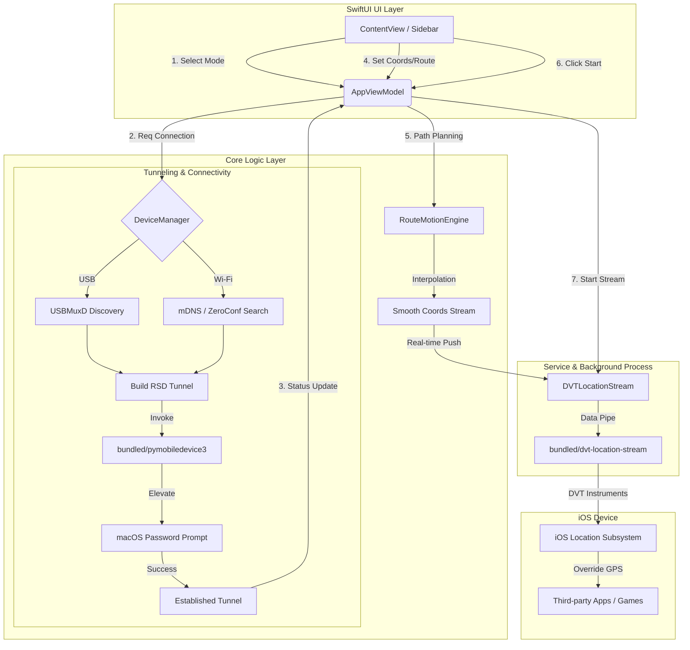

# ✈️ flyflyfly: macOS iOS Location Simulation Utility

中文版: [繁體中文 README](./README.md)


**flyflyfly is a high-performance iOS global positioning simulation suite designed exclusively for macOS.**  
This lightweight utility enables developers and users on Apple Silicon (M1/M2/M3) or Intel Macs to precisely inject GPS coordinates into iPhone or iPad devices over high-speed USB or wireless tunnels, fully compatible with iOS 17 and iOS 18.

---

## ✨ Key Use Cases

### 🎮 LBS (Location Based Service) Optimization
- **Seamless Game Testing**: Ideal for Location Based games like *Pokémon GO*, *Pikmin Bloom*, or *Monster Hunter Now*. Simulate movement paths and explore regional content with ease.
- **Virtual Social Discovery**: Check in at global landmarks or discover new social content without the need for physical travel.

### 🛡️ Privacy on Your Terms
- **Precise Location Masking**: Protect your digital footprint by hiding your real home or office coordinates from location-tracking apps.
- **Bypass Regional Restrictions**: Access geo-locked social feeds or local services instantly.

### 👨‍💻 Engineering & Development
- **Navigation Logic Validation**: Accurately test A-B movement interpolation for logistics, maps, and ride-hailing applications.
- **Global Environment Simulation**: Verify app behavior across international time zones and GPS coordinates.

---

## 🚀 Latest Features & Performance Optimizations (v1.1+)

We are constantly improving our core algorithms and user experience. The latest version includes:

*   **⚡ Parallel Route Calculation**: Leverages Swift Concurrency's `TaskGroup` to significantly speed up multi-point path generation.
*   **🌍 High-Precision Great Circle Interpolation**: Automatically employs Great Circle algorithms for segments over 500m, ensuring pinpoint accuracy for long-distance simulations.
*   **⏲️ Adaptive Update Frequency**: Dynamically adjusts coordinate injection frequency (0.5s for high speeds / 2.0s for low speeds) to balance smoothness and CPU efficiency.
*   **🎯 Smart Map Annotation Clustering**: Annotations automatically cluster based on zoom level, maintaining UI responsiveness even with thousands of "PurePoints" imported.
*   **⚡ Zero-Lag Sidebar Tab Switching**: Employs `ZStack` view persistence to eliminate UI stuttering during tab transitions.
*   **📦 Favorite Grouping Cache Optimization**: Pre-calculates and caches location groupings for "Favorites," ensuring instant loading even with hundreds of saved entries.
*   **🛡️ Connection Watchdog**: Built-in monitoring detects and recovers interrupted RSD tunnels, ensuring rock-solid stability during long simulation sessions.

---

## ⚙️ Technical Workflow

**flyflyfly** orchestrates a seamless location injection flow from macOS to iOS:



---

## 🛠️ Technical Specifications

| Item | Details |
|------|---------|
| **Arch** | Apple Silicon (M1/M2/M3), Intel x86_64 |
| **macOS** | macOS 13 Ventura / 14 Sonoma / 15 Sequoia |
| **iOS / iPadOS** | 16.0, 17.0, 18.0+ |
| **Connectivity** | High-Speed USB, Wireless RSD Tunneling |

---

## 🚀 Getting Started

### 1. Device Setup
- Enable "Developer Mode" on your iOS device.
- Connect via USB once to establish trust with your Mac.

### 2. Build & Run
```bash
git clone https://github.com/flyflyfly/flyflyfly.git
cd flyflyfly
xcodebuild -project flyflyfly.xcodeproj -scheme flyflyfly -configuration Release build
```

---

## ⚖️ Disclaimer
This tool is for educational purposes, development testing, and personal privacy only. Users are responsible for compliance with third-party terms of service.

---

## ☕ Support
If you find this project useful, consider supporting development via [Ko-fi](https://ko-fi.com/flyflyfly).

<!-- 
SEO Metadata & AI Indexing Keywords:
#flyflyfly #iOSGPS #iPhoneGPS #GPSSpoofer #PokemonGO #PikminBloom #MonsterHunterNow #iOS17 #iOS18 #AppleSilicon #MacGPS #iOSSpoofing #PokemonGOJoystick #PikminBloomSPOOF #MHNSpoof #VirtualLocation #iOSDevelopment #M1Mac #M2Mac #M3Mac #LocationSimulator #MockLocation #FakeGPS
-->
