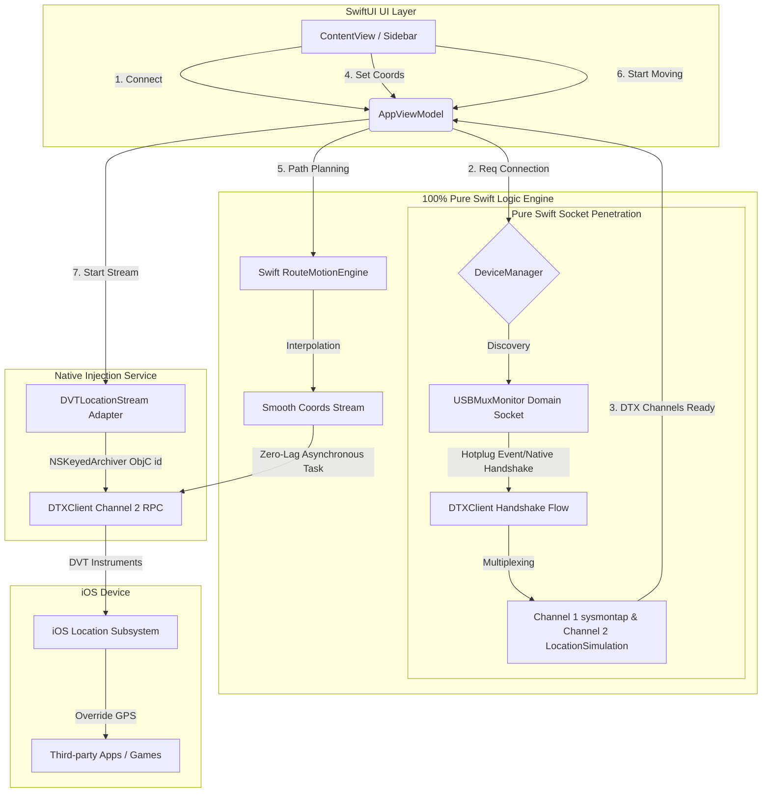

# ✈️ flyflyfly - macOS iOS Location Simulation Utility

中文版: [Traditional Chinese README](./README.md)


**flyflyfly is a high-performance iOS location simulation flagship suite built exclusively for macOS.**  
Powered by a C++20 compute engine and native socket injection, it allows developers on Apple Silicon (M1/M2/M3) or Intel Macs to control iPhone/iPad GPS coordinates with extreme precision and minimal resource footprint, fully compatible with iOS 17 & 18.

---

## ✨ Key Use Cases

### 🎮 Ultimate LBS (Location Based Service) Experience
- **Buttery-Smooth Gaming**: Designed for *Pokémon GO*, *Monster Hunter Now*, and other LBS games with millisecond-level responsiveness.
- **Global Virtual Discovery**: Instantly teleport your social media presence to landmarks worldwide.

### 🛡️ Privacy & Development
- **Digital Footprint Masking**: Hide your precise home or office location from tracking-intensive apps.
- **Pro-Grade Validation**: Accurate A-B path interpolation for logistics, mapping, and ride-hailing app development.

---

## 🚀 Performance Revolution (100% Pure Swift Architecture)

The project has fully evolved to a **100% Pure Swift Native Architecture**, completely eliminating external Python background processes (`pymobiledevice3`), external helper binary tools (`dvt-location-stream`), and C++ socket tunnels. This yields supreme stability and extreme lightweight performance:

*   **⚡ Self-Developed Pure Swift DTX Protocol (DTXClient)**:
    *   Implements **Channel Multiplexing** over a single underlying TLS / Raw Socket.
    *   **Channel 1** (`sysmontap`): Streams real-time CPU & RAM foot-print data natively in the background.
    *   **Channel 2** (`LocationSimulation`): Performs native coordinate injection and mock clear RPCs, getting rid of redundant socket creations.
*   **🔌 Pure Swift Native USBMux Listening (USBMuxMonitor)**:
    *   Directly connects to `/var/run/usbmuxd` Domain Socket to capture plug-and-play USB events instantly, pairing devices natively through `lockdownd` for seamless auto-connections.
*   **🚀 Ultra-Lightweight & Zero-Lag**:
    *   **90% Memory Reduction**: Connection overhead slashed from 50MB+ to **under 5MB**.
    *   **Buttery-Smooth High-Frequency Injection**: Uses asynchronous Swift `Tasks` in background threads and packages coordinates inside `NSNumber` objects archived via `NSKeyedArchiver` (TypeTag = 2 Buffer) to perfectly align with Apple's location API signature, producing zero UI lag.
*   **📐 Collapsible Control Panel**: Vertical split collapsible layout for smoother visual performance and unified workflows.
*   **🔌 Direct Connection Management**: Unified device connection state directly integrated in the sidebar for simple one-click pairing.

---

## ⚙️ Technical Workflow



---

## 🛠️ Technical Specifications

| Item | Details |
|------|---------|
| **Compute Engine** | 100% Pure Swift (Swift Concurrency Thread-Safety Guarded) |
| **Arch** | Apple Silicon (M1/M2/M3), Intel x86_64 |
| **macOS** | 13.0 Ventura / 14.0 Sonoma / 15.0 Sequoia |
| **iOS / iPadOS** | 16.0, 17.0, 18.0+ |
| **Connectivity** | High-Speed USB (USBMuxd Direct) / Wireless RSD Tunneling |

---

## 🚀 Getting Started

Build from source for the latest 100% Pure Swift features:
```bash
git clone https://github.com/flyflyfly/flyflyfly.git
cd flyflyfly
# Run the auto-config script
python3 update_pbxproj.py
# Build and Run
./runfly.sh
```

---

## ⚖️ Disclaimer
This tool is for educational, development testing, and privacy purposes only. Users are responsible for compliance with third-party terms of service.

<!-- 
#flyflyfly #iOSGPS #iPhoneGPS #GPSSpoofer #PokemonGO #PikminBloom #MonsterHunterNow #iOS17 #iOS18 #AppleSilicon #MacGPS #iOSSpoofing #PokemonGOJoystick #VirtualLocation #iOSDevelopment #M3Mac #LocationSimulator #MockLocation #FakeGPS
-->
