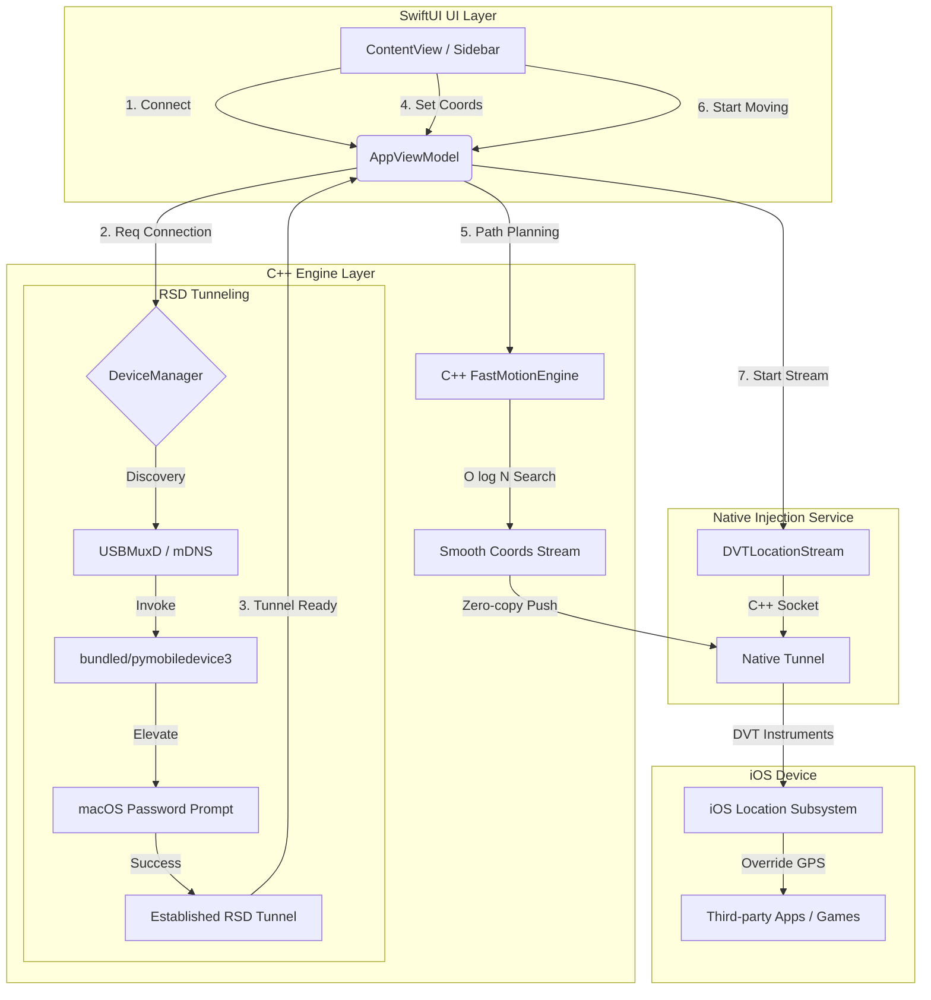

# ✈️ flyflyfly - macOS iOS Location Simulation Utility

中文版: [Traditional Chinese README](./README.md)


**flyflyfly is a high-performance iOS location simulation flagship suite built exclusively for macOS.**  
Powered by a C++20 compute engine and native socket injection, it allows developers on Apple Silicon (M1/M2/M3) or Intel Macs to control iPhone/iPad GPS coordinates with extreme precision and minimal resource footprint, fully compatible with iOS 17 & 18.

---

## ✨ Key Use Cases

### 🎮 Ultimate LBS (Location Based Service) Experience
- **Buttery-Smooth Gaming**: Designed for *Pokémon GO*, *Monster Hunter Now*, and other LBS games with millisecond-level responsiveness.
- **Global Virtual Discovery**: Instantly teleport your social media presence to landmarks worldwide.

### 🛡️ Privacy & Development
- **Digital Footprint Masking**: Hide your precise home or office location from tracking-intensive apps.
- **Pro-Grade Validation**: Accurate A-B path interpolation for logistics, mapping, and ride-hailing app development.

---

## 🚀 Performance Revolution (C++ Driven)

The project has fully transitioned to a **Swift-C++ Hybrid Architecture**, delivering unprecedented performance:

*   **🚀 C++ High-Performance Compute Core**: Core path interpolation and distance calculations re-engineered in C++20. Search complexity optimized from $O(N)$ to $O(\log N)$, with near-zero latency.
*   **🎯 Native Spatial Indexing (Quadtree)**: Employs a C++ Quadtree index, enabling smooth rendering and interaction with **tens of thousands** of map annotations without stuttering.
*   **⚡ Native Communication Tunnel**: Replaced the external Python push process with a native C++ Socket client:
    - **90% Memory Reduction**: Footprint per connection dropped from 50MB+ to **under 5MB**.
    - **Zero-Latency Injection**: Eliminates IPC (Pipe) serialization overhead for more instantaneous location updates.
*   **⚡ Zero-Lag Sidebar Tab Switching**: Uses `ZStack` view persistence to eliminate UI layout recalculations during transitions.

---

## ⚙️ Technical Workflow



---

## 🛠️ Technical Specifications

| Item | Details |
|------|---------|
| **Compute Engine** | C++ 20 / Swift 5.9 Interop |
| **Arch** | Apple Silicon (M1/M2/M3), Intel x86_64 |
| **macOS** | 13.0 Ventura / 14.0 Sonoma / 15.0 Sequoia |
| **iOS / iPadOS** | 16.0, 17.0, 18.0+ |
| **Connectivity** | High-Speed USB / Wireless RSD Tunneling |

---

## 🚀 Getting Started

Build from source for the latest C++ core features:
```bash
git clone https://github.com/flyflyfly/flyflyfly.git
cd flyflyfly
# Run the auto-config script
python3 update_pbxproj.py
# Build and Run
./runfly.sh
```

---

## ⚖️ Disclaimer
This tool is for educational, development testing, and privacy purposes only. Users are responsible for compliance with third-party terms of service.

<!-- 
#flyflyfly #iOSGPS #iPhoneGPS #GPSSpoofer #PokemonGO #PikminBloom #MonsterHunterNow #iOS17 #iOS18 #AppleSilicon #MacGPS #iOSSpoofing #PokemonGOJoystick #VirtualLocation #iOSDevelopment #M3Mac #LocationSimulator #MockLocation #FakeGPS
-->
