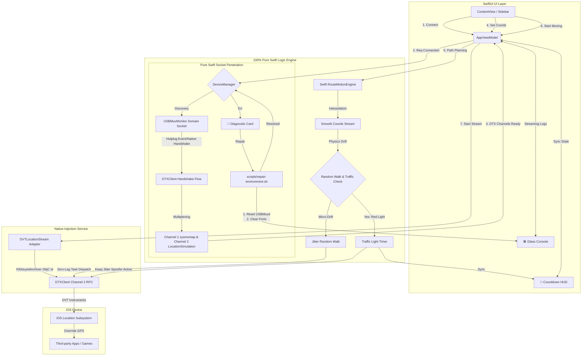

# ✈️ flyflyfly - macOS iOS Location Simulation Utility

中文版: [Traditional Chinese README](./README.md)


**Current Version**: `v0.99a`

**flyflyfly is a flagship-grade iOS location simulation utility built exclusively for macOS.**  
Powered by a **100% self-developed, highly efficient, pure Swift DTX protocol and USBMux Socket penetration architecture**, it allows developers and testers on Apple Silicon (M1/M2/M3/M4) or Intel Macs to spoof iPhone/iPad GPS coordinates with extreme precision and negligible resource consumption, fully supporting iOS 17, 18, and beyond.

---

## ✨ Flagship Features

### ⚡ Pure Swift DTX Core (Self-Developed)
*   **Channel Multiplexing**: Seamlessly operates multiple system streams over a single underlying TLS / Raw Socket connection, maximizing throughput and minimizing lag.
    *   *Channel 1 (sysmontap)*: Streams real-time device CPU & RAM footprint metrics natively in the background.
    *   *Channel 2 (coreservices.LocationSimulation)*: Handles coordinate setup, injection, and mock clear RPCs, completely eliminating redundant socket overhead.

### 🔌 Real-Time USBMux Domain Socket Listening (USBMuxMonitor)
*   **Instant Plug-and-Play**: Connects directly to `/var/run/usbmuxd` Domain Socket to capture hotplug events instantly at a millisecond level.
*   **Native Lockdownd Handshake**: Communicates directly with the device's lockdown service (Port 62078) to extract key metadata (DeviceName, ProductType, ProductVersion) natively without external helpers.

### 🚀 Ultra-Lightweight & Zero UI Stutter
*   **Extreme Efficiency**: Spawns zero external subprocesses, slashing runtime memory footprint from 50MB+ down to **under 5MB**.
*   **Smooth High-Frequency Injection**: Distributes coordinate generation using Swift asynchronous Tasks in background threads. Coordinates are serialized into NSNumber plist data via `NSKeyedArchiver` and transmitted as DTX Buffers (TypeTag = 2) to perfectly match Apple's native API signature, yielding a buttery-smooth route simulation.

### 🚦 Realistic Physical Jitter Spoofer (Anti-Cheat Defense)
*   **Random Walk Motion Engine**: Spoofing coordinates micro-drift smoothly between `[-0.25m, 0.25m]` (restricting drift radius to `[0.5m ~ 5.0m]`) during static pinpoints, movement, and red light delays. This perfectly mimics human hand tremors and defeats strict static GPS detection from third-party apps or games.

### 🚦 Smart Simulated Traffic Lights
*   **Natural Route Behaviors**: Randomly triggers red light delays lasting `[15s ~ 45s]` for every `[300m ~ 800m]` traveled to simulate realistic road congestion.
*   **Dynamic Countdown HUD**: Displays an elegant countdown HUD on the sidebar and status bar. During red-light stops, the traveling distance pauses while the spoofer continues to inject realistic physical jitter to defeat anti-cheat engines.

### 📐 Premium SwiftUI Design & One-Click Self-Healing
*   **Collapsible Modern Sidebar**: Vertical collapsible layout ensures maximum SwiftUI layout performance and smooth updates.
*   **Interactive Diagnostic Card**: Slides out beautiful, actionable steps (Developer Mode enablement, lock-screen trust prompts, cable inspections) when connectivity errors occur.
*   **One-Click Environment Auto-Repair**: Resets macOS local USBMuxd daemons and clears port conflicts with an elegant `.ultraThinMaterial` frosted glass logging panel streaming real-time stdout/stderr diagnostic feeds.

---

## ⚙️ Technical Workflow



---

## 🛠️ Technical Specifications

| Item | Details |
|------|---------|
| **Core Compute Standard** | 100% Pure Swift (Swift Concurrency Thread-Safety Guarded) |
| **Hardware Compatibility** | Apple Silicon (M1/M2/M3/M4 All Series), Intel x86_64 Mac |
| **System Version** | macOS 13+, iOS 16, 17, 18+ |
| **Connection Protocol** | High-Speed USB (USBMuxd Direct Socket) / Wireless RSD Tunnel |
| **Resource Footprint** | Memory < 5MB, CPU Usage close to 0% |

---

## 🚀 Getting Started

1. **Clone the Repository**:
   ```bash
   git clone https://github.com/flyflyfly/flyflyfly.git
   cd flyflyfly
   ```
2. **Build and Run**:
   Double-click to open `flyflyfly.xcodeproj` in Xcode. Select the main Scheme and hit **Run (⌘R)** to compile and launch the app natively under Debug or Release configurations!

---

## 📚 Documentation
*   **[Functional Specification (FSD)](./docs/FunctionalSpecification.md)**: Product features and user scenarios.
*   **[System Design (SD)](./docs/SystemDesign.md)**: Native Swift architecture, socket penetration, and optimization details.

## ⚖️ Open Source Attribution & Disclaimer

This project is an open-source implementation created strictly for academic research, technological exploration, and educational purposes. The core concepts are referenced and adapted from the open-source project [O.paperclip](https://github.com/agocia/O.paperclip). On top of the original work, this project has been deeply refactored into native Swift, performance-optimized, and security-hardened utilizing advanced Artificial Intelligence (AI) technologies.

This project is an independent research initiative and shares no commercial association, affiliation, endorsement, or partnership with the original project's authors.

**Important Notice to All Users**:
- This software is strictly intended for developmental debugging, academic study, educational analysis, and personal privacy protection. Do NOT use this tool for any commercial purposes that violate third-party terms of service, applicable laws, or local regulations.
- The authors and contributors of this project do not condone, support, or encourage any inappropriate or illegal usage. Users assume sole and full responsibility for all risks and legal liabilities (including but not limited to penalties under third-party terms of service) arising from the use of this software.
