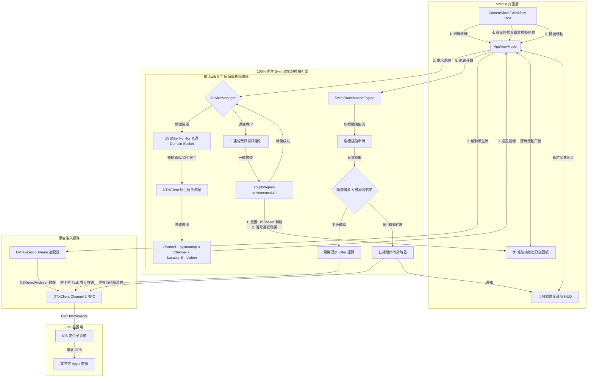

# ✈️ flyflyfly - macOS iOS Location Simulation Utility

English Version: [English README](./README.en.md)


**flyflyfly 是一款專為 macOS 打造的 iOS 全球定位模擬旗艦工具。**  
透過 C++20 效能引擎與原生 Socket 注入技術，讓開發者在 Apple Silicon (M1/M2/M3) 或 Intel Mac 上，以極低資源佔用精準控制 iPhone/iPad GPS 座標，完美支持 iOS 17 & 18。

---

## ✨ 核心應用場景

### 🎮 地理位置服務 (LBS) 極致體驗
*   **絲滑遊戲測試**：針對 *Pokémon GO*、*Monster Hunter Now* 等遊戲，提供毫秒級反應的移動模擬。
*   **全球虛擬打卡**：即時切換社群定位，足跡遍佈全球名勝。

### 🛡️ 隱私與開發測試
*   **數位足跡隱蔽**：徹底遮蔽真實住家/辦公位置，防止 App 追蹤。
*   **專業算法驗證**：精確模擬 A-B 路徑插值，適合地圖與物流應用開發。

---

## 🚀 性能革命 (100% 純 Swift 原生架構)

本專案已完成向 **100% 全原生 Swift 自研架構** 的革命性進化，淘汰了所有外部 Python（`pymobiledevice3`）背景進程、外部二進位工具（`dvt-location-stream`）以及 C++ 混合通訊隧道，帶來前所未有的極致效能與原生穩定性：

*   **⚡ 純 Swift 自研 DTX 協定 (DTXClient)**：
    *   在單一的 TLS / Raw Socket 通道上，實現了**通道多路複用 (Channel Multiplexing)**。
    *   **Channel 1** (`sysmontap`)：原生背景提取即時 CPU / RAM 系統數據。
    *   **Channel 2** (`LocationSimulation`)：原生發送與清空模擬座標，徹底消除多個 Socket 的重複建立開銷。
*   **🔌 純 Swift 原生 USBMux 監聽 (USBMuxMonitor)**：
    *   直接對接 `/var/run/usbmuxd` Domain Socket，毫秒級監聽熱插拔事件，並直連 `lockdownd` 提取設備元數據，實現極致流暢的「即插即連」。
*   **🚀 極致輕量與零延遲**：
    *   **記憶體節省 90%**：運行開銷從 50MB+ 降至 **5MB 以下**。
    *   **高頻軌跡完美注入**：藉由 Swift 異步 Task 背景派發，與經由 `NSKeyedArchiver` 序列化的 `NSNumber` 物件（TypeTag = 2 Buffer 形式）傳遞，完美契合 Apple 位置模擬 API 的預期簽名，達成零卡頓的高更新率注入。
*   **📐 垂直摺疊控制面板**：分段摺疊設計，操作直觀，介面反應毫秒級同步。
*   **🔌 一鍵直覺連線管理**：連線按鈕與裝置狀態無縫整合，一鍵即可完成手機與 Mac 的原生 DTX 連結。

---

## 🚦 真實防作弊與一鍵排障自癒 (NEW)

專案最新引入了兩大突破性模組，將 GPS 模擬的防作弊安全性與裝置連線的自癒能力拉升至全新高度：

*   **🚦 真實隨機漫步漂移 (Jitter Spoofer)**：實作平滑連續的「隨機漫步 (Random Walk)」物理運動模型。模擬位置在定點定位、行進中與紅綠燈停等時皆會以 `[-0.25m, 0.25m]` 步長進行微幅呼吸式晃動（約束於 `[0.5m ~ 5.0m]` 自訂半徑），完美防禦第三方 App 與遊戲的靜態定位偵測。
*   **🚦 隨機紅綠燈模擬 (Simulated Traffic Lights)**：路線行進時每行駛 `[300m ~ 800m]` 隨機遇紅燈停等 `[15 ~ 45]` 秒。停等時距離停止累加，但持續發送防作弊隨機漂移點位，並於 Sidebar 與狀態列同步顯示精緻的 **紅綠燈倒數計時 HUD**。
*   **🔌 連線故障疑難排障指引**：當發生連線故障時，自動滑出高質感四大檢修步驟卡片，包含螢幕解鎖信任、開發者模式啟動指引、拔插檢查等手動排障說明。
*   **🛠️ 一鍵修復環境依賴 (One-Click Environment Repair)**：一鍵在背景啟動自動化修復腳本，重置 macOS 本地 USBMuxd 系統服務（修復 90% 的 USB 連線感應卡頓、通訊衝突與通道佔用問題），確保全原生 Swift 連線核心的最高穩定性。
*   **📺 實時滾動毛玻璃日誌主控台**：修復過程中，會拉起高質感的 `.ultraThinMaterial` 毛玻璃面板，即時以滾動終端日誌展示修復每一步的 stdout/stderr 進度，掌控感十足。

---

## ⚙️ 技術工作流程 (Technical Workflow)



---

## 🛠️ 技術指標

| 項目 | 支援規格 |
|------|-------------|
| **引擎標準** | 100% Pure Swift (Swift Concurrency 執行緒安全保護) |
| **硬體架構** | Apple Silicon (M1/M2/M3), Intel x86_64 |
| **系統版本** | macOS 13+, iOS 16, 17, 18+ |
| **通訊方式** | USB High-Speed (USBMuxd 直連) / 無線 RSD 隧道 |

---

## 🚀 快速上手

目前 100% 原生 Swift 版本建議直接編譯建置：
```bash
git clone https://github.com/flyflyfly/flyflyfly.git
cd flyflyfly
# 執行自動配置腳本
python3 update_pbxproj.py
# 編譯並執行
./runfly.sh
```

---

## 📚 延伸文檔 (Documentation)
*   **[功能規格文件 (FSD)](./docs/FunctionalSpecification.md)**：詳細功能模組與使用者操作流程。
*   **[系統設計文件 (SD)](./docs/SystemDesign.md)**：技術架構、C++ 引擎與效能優化細節。

---

## ⚖️ 免責聲明
本工具僅供教育、開發測試與隱私保護用途。使用者須自行承擔法律與第三方服務條款之風險。

<!-- 
#flyflyfly #iOSGPS #iPhoneGPS #GPSSpoofer #PokemonGO #PikminBloom #MonsterHunterNow #iOS17 #iOS18 #AppleSilicon #MacGPS #iOS定位修改 #iPhone虛擬定位 #iOS開發測試 #AppleM3 #LocationSimulator #MockLocation #FakeGPS
-->
