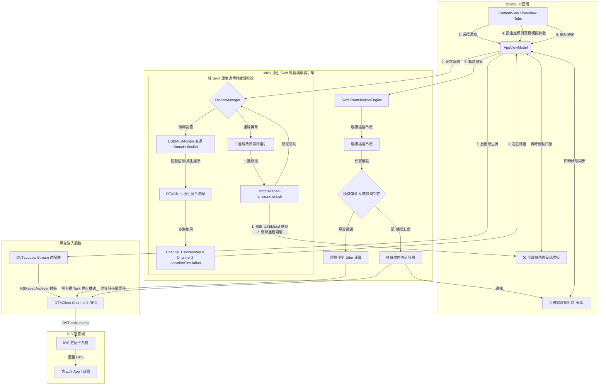

# ✈️ flyflyfly - macOS iOS Location Simulation Utility

English Version: [English README](./README.en.md)


**當前最新版本**：`v0.99`

**flyflyfly 是一款專為 macOS 打造的 iOS 全球定位模擬旗艦級工具。**  
基於 **100% 原生 Swift 自研 DTX 協定與 USBMux 滲透技術**，讓開發者與測試人員在 Apple Silicon (M1/M2/M3/M4) 或 Intel Mac 上，以極低資源佔用精準控制 iPhone/iPad GPS 座標，完美支持 iOS 17、18 及其以上版本。

---

## ✨ 旗艦級核心功能 (Key Features)

### ⚡ 自研純 Swift 原生 DTX 核心 (Pure Swift DTX Core)
*   **通道多路複用 (Channel Multiplexing)**：在單一的 TLS / Raw Socket 連道上，複用多個控制服務，完美兼顧效能與反應速度。
    *   *Channel 1 (sysmontap)*：原生背景提取即時 CPU / RAM 系統數據，掌握裝置效能。
    *   *Channel 2 (coreservices.LocationSimulation)*：原生進行定位模擬的設定、注入與清空清除，杜絕頻繁開閉通訊端的開銷。

### 🔌 USBMux 網域 Socket 實時監聽 (USBMuxMonitor)
*   **即插即連 (Instant Hotplug)**：直連 macOS 本地 `/var/run/usbmuxd` Domain Socket，毫秒級感應 USB 插拔事件。
*   **原生 Lockdownd 握手**：透過純 Swift 直連裝置 Port 62078 進行握手，原生安全提取設備元數據（DeviceName, ProductType, ProductVersion 等），打造絲滑的自動連接體驗。

### 🚀 極致效能與零 UI 卡頓 (Ultra-Lightweight)
*   **超低資源佔用**：捨棄一切重型外部行程調用，運行記憶體開銷降至 **5MB 以下**，CPU 佔用近乎為零。
*   **高頻平滑軌跡注入**：利用 Swift 異步 Task 在背景執行緒進行點位計算，將經緯度包裹於 `NSKeyedArchiver` 序列化的 `NSNumber` 二進位 Plist Buffer (TypeTag = 2) 中直接注入，完美契合 Apple 位置模擬 API 的預期簽名，提供如絲般順滑的行進軌跡。

### 🚦 真實物理防作弊漫步漂移 (Jitter Spoofer)
*   **隨機漫步模型 (Random Walk)**：位置在定點定位、行進中與紅綠燈停等時，皆會以 `[-0.25m, 0.25m]` 步長進行微幅呼吸式晃動（約束於 `[0.5m ~ 5.0m]` 自訂半徑），完美防禦第三方 App 與遊戲對「完美靜止」狀態的偵測。

### 🚦 智慧紅綠燈停等模擬 (Simulated Traffic Lights)
*   **真實路網停等**：路線模擬行進時，每行駛 `[300m ~ 800m]` 隨機遭遇紅燈停等 `[15s ~ 45s]`，模擬真實交通狀況。
*   **精緻 HUD 倒數**：停等時距離停止累加，持續發送微幅防作弊漂移點位，並於 Sidebar 與狀態列同步顯示精緻的 **紅綠燈倒數計時 HUD**。

### 📐 高質感 UI 與一鍵自癒修復 (Premium UI & Self-Healing)
*   **垂直摺疊控制面板**：採用高質感現代設計，分段摺疊 Section 保障主執行緒 AttributeGraph 渲染效能，介面反應毫秒級同步。
*   **排障診斷指引卡片**：當偵測到連線異常時，自動滑出精緻的檢修指引（包含螢幕解鎖信任、開發者模式啟動指引、拔插檢查等）。
*   **一鍵環境自動修復**：內建自癒修復腳本，一鍵重置 macOS 本地 USBMuxd 系統服務，自動排除連線埠佔用與通道衝突，過程以高質感毛玻璃面版即時滾動終端日誌。

---

## ⚙️ 技術工作流程 (Technical Workflow)



---

## 🛠️ 技術指標 (Specifications)

| 項目 | 支援規格 |
|------|-------------|
| **核心開發標準** | 100% Pure Swift (Swift Concurrency 執行緒安全保護) |
| **硬體相容性** | Apple Silicon (M1/M2/M3/M4 全系列), Intel x86_64 Mac |
| **系統要求** | macOS 13+, iOS 16, 17, 18+ |
| **傳輸協議** | USB High-Speed (USBMuxd 直連) / 無線 RSD 隧道連線 |
| **資源消耗** | 記憶體 < 5MB, CPU 佔用趨近於 0% |

---

## 🚀 快速上手 (Quick Start)

1. **複製專案**：
   ```bash
   git clone https://github.com/flyflyfly/flyflyfly.git
   cd flyflyfly
   ```
2. **開啟並編譯**：
   雙擊開啟 `flyflyfly.xcodeproj`，在 Xcode 中選擇主 Scheme，點擊 **Run (⌘R)** 即可直接以原生方式在 Debug/Release 配置下編譯並運行 App！

---

## 📚 延伸文檔 (Documentation)
*   **[功能規格文件 (FSD)](./docs/FunctionalSpecification.md)**：詳細功能模組與使用者操作流程。
*   **[系統設計文件 (SD)](./docs/SystemDesign.md)**：基於 100% 全原生 Swift 架構的技術設計與優化細節。

## ⚖️ 開源致敬與免責聲明 (Attribution & Disclaimer)

本專案為研究與技術探索目的之開源實現。本專案核心技術參考自開源專案 [O.paperclip](https://github.com/agocia/O.paperclip)，並在此基礎上利用先進人工智慧（AI）技術進行了深度的原生 Swift 架構重構、性能優化與程式碼安全加固。

本專案是一個獨立的開源研究項目，與原專案作者無任何商業關係、關聯或背書關係。

**請使用者特別注意**：
- 本軟體僅供開發調試、學術研究、教育探討與個人隱私防護目的使用，請勿將其用於任何違反服務條款、法律法規或不正當競爭之商業目的。
- 專案作者與貢獻者不鼓勵亦不支持任何不當使用行為。使用者須自行承擔因使用本軟體所產生之任何直接或間接法律責任與風險（包括但不限於第三方服務條款之處罰）。
