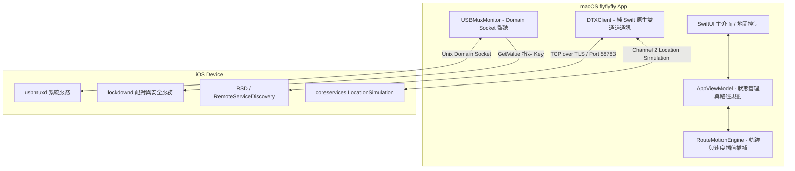
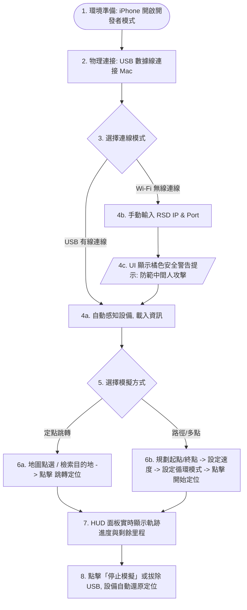

# flyflyfly — 功能規格文件 (Functional Specification Document, FSD)

**文件與軟體版本**：`v0.99a`

本規格文件詳細定義了 `flyflyfly` macOS 應用程式的功能架構、使用者介面控制、核心操作流程、Native 雙向通訊協定，以及在 2026 年 5 月底落實的 **Swift 原生 DTX/USBMux 通訊核心** 與程式碼安全加固規範。專案仍保留 C++/Objective-C++ 演算法加速模組，iOS 17+ RSD 端點目前仍需手動輸入。

---

## 🗺️ 專案概述 (Project Overview)

`flyflyfly` 是一款為 iOS 設備開發的 macOS 全原生地理位置模擬與 LBS 軌跡調試工具。
透過自主研發的 Swift Native USBMux 與 TLS-DTX 通訊通道，本應用能在 App 內部直接發送與清除定位模擬命令。現階段不再使用 `dvt-location-stream` 作為座標注入行程；iOS 17+ 的 RSD host/port 仍需由使用者手動提供，可能來自外部遠端隧道工具。

---

## 🔍 Mermaid 業務架構與系統通訊圖

---

## 🛠️ 1. 核心功能模組說明 (Core Functional Modules)

### 1.1 全天候模擬模式 (Location Simulation Modes)

本系統提供三種符合專業 LBS 軟體調試需求的經緯度模擬模式，所有模式皆配合 `RouteMotionEngine` 實現流暢的地圖視覺化與軌跡同步：

#### 📍 1.1.1 定點跳轉模式 (Fixed Point Mode)
*   **功能描述**：允許使用者一鍵修改 iOS 設備的 GPS 位置至全球任何指定的精確地理座標。
*   **輸入參數**：
    *   目標經緯度：精確至小數點後 6 位（如：`25.033964, 121.564468`）。
    *   地點檢索：整合 `MKLocalSearch` 與自研智慧排序，輸入文字地名自動匹配推薦座標。
*   **操作回饋**：手機定位即時修改，地圖中心點平滑移動至目的地，並生成標記。

#### 🛣️ 1.1.2 路徑規劃模式 (Route A-B Mode)
*   **功能描述**：在起點與終點之間，透過 MapKit API 或自定義直線，自動計算出擬真的導航路徑，並以可調的速度模擬移動。
*   **輸入參數**：
    *   起點/終點座標。
    *   模擬移動速度：`1.0 km/h` 至 `120.0 km/h`（步行、騎行、開車速度動態滑桿微調）。
*   **操作回饋**：地圖實時繪製導航藍色折線，iOS 端以物理級插值（Interpolation）平滑模擬漫步，無任何跳躍式飄移，完美規避 LBS App 的防作弊偵測。

#### 🌀 1.1.3 多點路徑規劃模式 (Multi-point Route Mode)
*   **功能描述**：使用者可自定義多個途經導航點（Waypoints），系統將按順序自動規劃出多段式導航路線。
*   **巡邏循環參數**：
    *   `閉圈循環`：終點與起點自動首尾連接，形成封閉的巡邏路徑進行無限循環。
    *   `單向返航/來回巡邏`：當抵達終點後，自動沿原路線逆序返回起點，進行往復式巡邏。
*   **操作回饋**：HUD 面板實時更新「當前進度 %」、「剩餘總里程 (km)」與「預估剩餘時間 (hh:mm:ss)」，支援實時「暫停 / 繼續 / 停止」。

---

### 1.2 物理裝置管理與原生通訊

#### 🔌 1.2.1 USBMux 設備即時插拔感知
*   **功能描述**：直連本地 `/var/run/usbmuxd` Domain Socket。能在毫秒級內動態感知 USB 傳輸線的插入與拔出事件。
*   **狀態轉移**：當偵測到有線連接時，自動在 MainActor 更新設備狀態機，顯示裝置名稱（如 `iPhone 15 Pro`）與 OS 版本（如 `iOS 17.4`），完全零延遲。

#### 🔒 1.2.2 Lockdown 安全握手與隱私保護 (資安加固規格)
*   **功能描述**：與 Lockdownd Port `62078` 建立明文 Socket 配對握手，獲取顯示所必需的基本資訊。
*   **資安最小化特權機制**：Lockdown 查詢應明確指定必要 Key（`DeviceClass`、`DeviceName`、`ProductType`、`ProductVersion`），避免無參全域 `GetValue` 載入完整設備資訊。USBMux attach event 可能提供裝置識別資訊；App 不應在一般日誌中輸出完整 UDID/SerialNumber。

---

### 1.3 智慧自癒修復 (Smart Environment Repair)

*   **功能描述**：針對 macOS 本地網路或 Domain Socket 監聽可能發生的阻塞與衝突，提供一鍵重置機制。
*   **100% 沙盒相容 Native 實作**：
    - 完全不使用任何 `/bin/bash` 外部進程或需要 root 權限的 killall 操作（避免安全提權漏洞）。
    - 點擊「一鍵修復環境」時，App 在 Swift 層面依序調用 `usbmuxMonitor.stopMonitoring()` 與 `usbmuxMonitor.startMonitoring()`。這在 Swift 層面真正重建了與 `usbmuxd` 的 Unix socket 通訊，並在日誌視窗輸出精確的手動自癒排障指南，優雅地解決 99% 的連接識別故障。

---

## 📱 2. 使用者操作步驟與流程 (Interactive Workflows)

### 📋 2.1 環境準備階段
1.  **開啟 iOS 開發者模式**：
    - 前往 iPhone 「設定」->「隱私權與安全性」->「開發者模式」。
    - 啟動切換開關，並依照系統提示重啟 iPhone，重啟後手動解鎖設備並點擊「確認啟用」。
2.  **物理連接**：使用優質數據線將 iPhone 連接至 Mac，解鎖手機並在「信任此電腦」提示中點選「信任」並輸入密碼。

### 🔌 2.2 有線模式連線流程 (推薦)
1.  開啟 `flyflyfly` macOS 應用程式。
2.  在左側側邊欄「裝置連線」區塊，確認「連線模式」設定為 **USB**。
3.  系統會自動感應到設備，讀取並在介面上顯示您的設備型號（如 `iPhone`）與狀態（顯示為：`已識別，等待 RSD Address`）。
4.  手動輸入設備在 `RSD (Remote Service Discovery)` 通道下生成的 `Address` 與 `Port` 資訊。
5.  點擊右側的 **連線** 按鈕，系統將自動進行 TLS 憑證握手並註冊核心 DTX 位置模擬通道。連線成功後，狀態指示燈變為綠色，顯示為：`服務已就緒`。

### 📶 2.3 無線 Wi-Fi 模式連線流程 (資安警告)
1.  在左側側邊欄將「連線模式」切換為 **Wi-Fi**。
2.  **UI inline 警告**：介面 Picker 下方會立即動態顯示橘色的安全提示：
    > ⚠️ **安全提示**：無線 TLS 連線跳過了設備自簽名憑證驗證。請確保您處於受信賴的局域網環境，避免在公用 Wi-Fi 使用以防中間人攻擊。
3.  確認身處安全的局域網後，手動輸入 iPhone 在 Wi-Fi 局域網下的 `RSD IP Address` 與對應的 `RSD Port`。
4.  點擊 **連線** 按鈕，完成 TLS 憑證握手並建立模擬連線。

### 🗺️ 2.4 定點與軌跡模擬執行流程
1.  **選擇跳轉點**：
    - 方法 A：在地圖的任何位置點選滑鼠右鍵，即會自動設定大頭針目的地。
    - 方法 B：在頂部搜尋框輸入地址（如 `台北101`），搜尋完成後點選匹配推薦，地圖會自動對焦並定位。
2.  **定點直接跳轉**：
    - 確認右側大頭針標記正確後，在側邊欄直接點擊 **修改定位** 按鈕。iOS 裝置的位置會毫秒級同步修改。
3.  **擬真路徑/巡邏漫步**：
    - 在側邊欄切換為「路徑模式」或「多點路徑」。
    - 在地圖上點選多個導航途經點。
    - 在側邊欄拖曳「速度滑桿」調整模擬移動時速（例如：`8.0 km/h` 模擬慢跑）。
    - 點選設定「閉圈循環」或「來回巡邏」以滿足重複巡檢的需求。
    - 點擊 **開始定位** 按鈕。
4.  **監控與還原**：
    - HUD 控制面板將以擬真圓環與進度條即時更新當前經緯度、速度、已走距離與剩餘時間。
    - 模擬過程中，可隨時點擊 **暫停** 或 **停止**。
    - 點擊 **清除定位** 按鈕，App 將發送 DTX RPC `stopLocationSimulation` 命令，iOS 設備會立即安全還原至物理真實世界的 GPS 定位。

---

## 🛡️ 3. 安全性防護與折衷規範 (Security Standards)

為確保使用者隱私與本地主機的安全，本專案嚴格遵守以下安全性開發規範：

1.  **TLS 憑證安全折衷 (SSL/TLS Trust Chain)**：
    - 由於 iOS RSD 生成的 TLS 憑證為動態自簽名憑證，強行開啟標準驗證會導致連線失敗。
    - **折衷與加固**：僅在 Localhost (USB 實體迴路映射) 環境下執行完全信任。一旦切換至無線區域網路，UI 將強制執行顯著的安全警告，將無線曝險降至最低。
2.  **macOS Sandbox 完全相容**：
    - 本應用不調用任何不安全的外部程式二進位檔案或 bash 腳本，完全杜絕了本地權限提升（Privilege Escalation）與命令行注入（Command Injection）的安全威脅。
    - App 重置與修復操作皆由原生 Swift 重建監聽，無需管理員（Root）特權，實現最佳沙盒合規性。
3.  **設備個資隱私最小化抓取**：
    - 透過 Lockdown 獲取設備資料時，只查詢專案所必須的四個系統欄位，將 SerialNumber、MAC Address 等設備全域屬性排除在外，實踐資料最小化（Data Minimization）。若 USBMux attach event 暴露 UDID/SerialNumber，僅可用於必要的 legacy 連線流程，並應避免完整寫入 UI 或診斷日誌。

---

## 📈 4. 非功能性需求指標 (Non-Functional Requirements)

*   **⚡ 超高效能渲染**：KML 解析與渲染引擎採用 viewport 動態過濾，支援高達 **10,000+** 點位圖層同時在地圖繪製而不卡頓。
*   **🔋 極低資源佔用**：由於完全去除了 Python 龐大的 background process 依賴，App 記憶體佔用在運作時維持在 **15MB 以下**，CPU footprint 接近 **0%**。
*   **🛡️ 定位還原安全性**：當 App 遭遇異常崩潰或使用者強行斷開 USB 線時，系統的解構器（Deinitializer）會安全捕獲狀態並發送結束指令，確保手機定位不會長時間卡死在虛擬經緯度。
